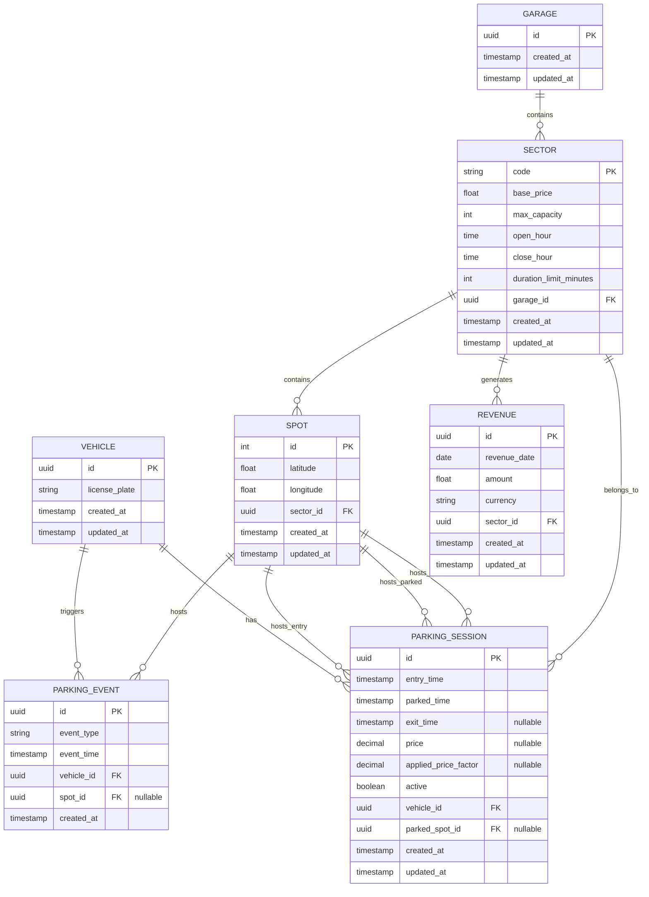

# Database Schema (DER Model)

## Entity Descriptions

### GARAGE

Represents the entire parking garage facility.

### SECTOR

Represents a section of the garage with specific pricing and capacity rules.

### SPOT

Represents an individual parking spot with its geolocation.

### VEHICLE

Represents a vehicle identified by its license plate.

### PARKING_EVENT

Represents events related to vehicles (entry, parked, exit).

### PARKING_SESSION

Represents a complete parking session from entry to exit, including pricing information.

### REVENUE

Represents the daily revenue for each sector.

## Relationships

- A Garage contains multiple Sectors
- A Sector contains multiple Spots
- A Sector generates multiple Revenue records (daily)
- A Vehicle triggers multiple Parking Events
- A Vehicle has multiple Parking Sessions
- A Spot hosts multiple Parking Events
- A Spot hosts multiple Parking Sessions (entry, parked, exit)
- A Sector belongs to multiple Parking Sessions